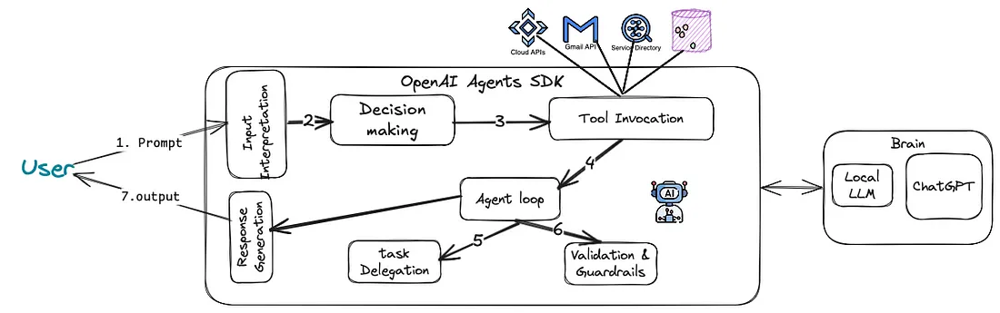

# Qu'est-ce que Agents SDK ?

<v-clicks>

- Un framework créé par OpenAI (suite de Swarm)
- Uniquement en Python
- Simple d'utilisation

</v-clicks>

<v-clicks>

Quelques composants clés :
- Gestionnaire d'exécution des agents
- Délégation des tâches (handoff)
- Pipelines de validation (guardrails)
- Observabilité (tracing)

</v-clicks>

---
transition: slide-left
---

# Worflow de traitement

---
transition: slide-left
---

# Comparaison avec les autres frameworks

| **Fonctionalités** | **Agents SDK** | **LangGraph** | **Crew.AI** |
| --------- | ----------- | ------ | --------------- |
| **Paradigme** | Orchestration d'agents | Composants | Gestion des rôles |
| **Validation** | Pydantic | Spécifiques | Tâches définies |
| **Intégration** | Flexible, OpenAI | Ecosystème | LangChain |
| **Observabilité** | Intégré | LangSmith | Limité | 
| **Apprentissage** | Facile | Difficile | Modéré |
| **Cas d'usage** | Centré sur OpenAI | Systèmes complexes | Tâches nécessitant des spécialistes |