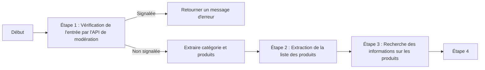
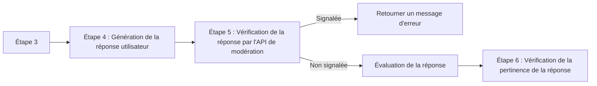
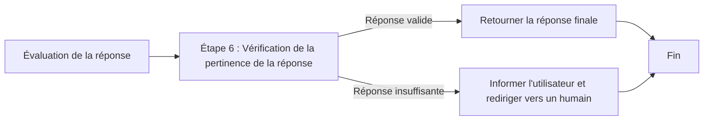

# Construire des applications avec les API des LLMs

Comment interroger les API des LLMs

<div v-click="1">
```python {all|all|1|2|3|4|11|all}
def get_completion_from_messages(messages, 
                                 model="gpt-4o-mini", 
                                 temperature=0, 
                                 max_tokens=500):
    response = client.chat.completions.create(
        model=model,
        messages=messages,
        temperature=temperature, # this is the degree of randomness of the model's output
        max_tokens=max_tokens, # the maximum number of tokens the model can ouptut 
    )
    return response.choices[0].message.content
```
</div>

<div v-click="7">
```python {all|2|2-4|5|5-6|all}
messages =  [  
{'role':'system',
 'content':"""Vous êtes un assistant qui réponds en prenant le style d'un conteur pour enfants.
Toutes vos réponses doivent être d"une seule phrase."""},    
{'role':'user',
 'content':"""Ecrivez une histoire sur une carotte heureuse."""},
] 
```
</div>

---
transition: slide-left
---

# Construire des applications avec les API des LLMs

La gestion des clés d'API

```python {all|5|7-10|all}
from openai import OpenAI
import os

from dotenv import load_dotenv, find_dotenv
_ = load_dotenv(find_dotenv())

client = OpenAI(
    # This is the default and can be omitted
    api_key=os.getenv('OPENAI_API_KEY')
)
```
<div v-click>
Quelques règles essentielles :
</div>

<v-clicks>

- Ne jamais partager vos clés d'API
- Ne jamais les stocker dans un dépôt public
- Ne jamais les stocker dans un fichier accessible publiquement
</v-clicks>

---
transition: slide-left
---

# Construire des applications avec les API des LLMs

La classification des entrées

```python {1-2|3-4|5-13|all}
system_message = f"""Vous recevrez des demandes de service client.
La demande de service client sera délimitée par les caractères {delimiter}.
Classez chaque demande dans une catégorie principale et une catégorie secondaire.
Fournissez votre sortie au format JSON avec les clés : primaire et secondaire.

Catégories principales : Facturation, Support Technique,
Gestion de Compte ou Demande Générale.

Catégories secondaires de facturation :
Se désabonner ou mettre à niveau
Ajouter un mode de paiement
Explication de la charge
Contester une charge"""
```
<div v-click>
```md
Je veux payer ma facture en bitcoin
```
</div>

<div v-click>
```json
{
  "primaire": "Facturation",
  "secondaire": "Ajouter un mode de paiement"
}
```
</div>

---
transition: slide-left
---
# Construire des applications avec les API des LLMs

L'utilisation des API de modération

| Catégorie | Description | Modèle | Type de contenu |
| --------- | ----------- | ------ | --------------- |
| harassment | Content that expresses, incites, or promotes harassing language towards any target. | All | Text only
| harassment/threatening | Harassment content that also includes violence or serious harm towards any target. | All | Text only
| hate | Content that expresses, incites, or promotes hate based on race, gender, ethnicity, religion, nationality, sexual orientation, disability status, or caste. Hateful content aimed at non-protected groups (e.g., chess players) is harassment. | All | Text only


---
transition: slide-left
---

# Construire des applications avec les API des LLMs

L'utilisation des API de modération

```json {all|6|7-12|13-18|all}
{
  "id": "modr-970d409ef3bef3b70c73d8232df86e7d",
  "model": "omni-moderation-latest",
  "results": [
    {
      "flagged": true,
      "categories": {
        "harassment": false,
        "harassment/threatening": false,
        "hate": false,
        "hate/threatening": false,
      },
      "category_scores": {
        "harassment": 0.0011643905680426018,
        "harassment/threatening": 0.0022121340080906377,
        "hate": 3.1999824407395835e-7,
        "hate/threatening": 2.4923252458203563e-7,
      },
    }
  ]
}
```

---
transition: slide-left
---

# Construire des applications avec les API des LLMs

Méthode de traitement : Chain of Thought
```python {1|4-7|8-10|12-15|17-18|20-24|all}
system_message = f"""Suivez ces étapes pour répondre aux demandes des clients.
La demande du client sera délimitée par quatre hashtags, c'est-à-dire {delimiter}.

Étape 1:{delimiter} Décidez d'abord si l'utilisateur
pose une question sur un produit spécifique ou sur des produits.
La catégorie de produits ne compte pas.

Étape 2:{delimiter} Si l'utilisateur pose des questions sur des 
produits spécifiques, identifiez si les produits figurent dans 
la liste suivante. Tous les produits disponibles : 

Étape 3:{delimiter} Si le message contient des produits dans la liste ci-dessus,
énumérez toutes les hypothèses que l'utilisateur fait dans son message,
par exemple que l'ordinateur portable X est plus grand que l'ordinateur portable Y,
ou que l'ordinateur portable Z a une garantie de 2 ans.

Étape 4:{delimiter} : Si l'utilisateur a fait des hypothèses, déterminez si 
l'hypothèse est vraie en vous basant sur vos informations sur les produits.

Étape 5:{delimiter} : D'abord, corrigez poliment les hypothèses incorrectes 
du client si applicable. Mentionnez ou faites référence uniquement aux produits 
dans la liste des 5 produits disponibles, car ce sont les seuls 5 produits que 
le magasin vend. Répondez au client avec un ton amical."""
```

---
transition: slide-left
---
# Construire des applications avec les API des LLMs

Méthode de traitement : Chain of Thought

```python
sytem_prompt = f"""
Utilisez le format suivant :
Étape 1 :{delimiter} <step 1 reasoning>
Étape 2 :{delimiter} <step 2 reasoning>
Étape 3 :{delimiter} <step 3 reasoning>
Étape 4 :{delimiter} <step 4 reasoning>
Réponse pour l'utilisateur : {delimiter} <response to customer>"""
```

---
transition: slide-left
---
# Construire des applications avec les API des LLMs

Enchainement de prompts

Pourquoi enchaîner les prompts :
<v-clicks>

- Obtenir des réponses plus précises
- Découper les tâches
- Spécialiser certaines tâches
- Réduire le nombre de token utilisés
- Faciliter les tests
- Utiliser des outils externes
- Utiliser des modèles différents
- Mélanger IA et traitements déterministes
</v-clicks>

---
transition: slide-left
---
# Construire des applications avec les API des LLMs

Un workflow complet

<div v-click>


</div>

<div v-click>

</div>

<div v-click>

</div>

---
transition: slide-left
---
# Construire des applications avec les API des LLMs

L'évaluation du système


---
transition: slide-left
---

# Construire des applications avec les API des LLMs

L'évaluation du système

```python {1-5|7-9|11|12-13|14|15-|all}
user_message = f"""Vous évaluez une réponse soumise à une question en fonction du contexte que l'agent 
utilise pour répondre à la question. Voici les données :
[Question] : {cust_msg}
[Contexte] : {context}
[Soumission] : {completion}

Comparez le contenu factuel de la réponse soumise avec le contexte.
Ignorez toute différence de style, de grammaire ou de ponctuation.
Répondez aux questions suivantes :

La réponse de l'assistant est-elle basée uniquement sur le contexte fourni ? (O ou N)
La réponse inclut-elle des informations qui ne sont pas fournies 
dans le contexte ? (O ou N)
Y a-t-il un désaccord entre la réponse et le contexte ? (O ou N)
Comptez combien de questions l'utilisateur a posées. (output un nombre)
Pour chaque question posée par l'utilisateur, y a-t-il une réponse correspondante ?
Question 1 : (O ou N)
Question 2 : (O ou N)
...
Question N : (O ou N)
Parmi le nombre de questions posées, combien d'entre elles ont été 
abordées par la réponse ? (output un nombre) """
```

---
transition: slide-left
---

# Construire des applications avec les API des LLMs

L'évaluation du système

```python {1-9|11-14|15-|all}
user_message = f"""Vous êtes un assistant qui évalue la qualité des réponses d'un agent du 
service client à une question d'utilisateur en comparant la réponse à la 
réponse idéale (d'expert). Output a single letter and nothing else.

Vous comparez une réponse soumise à une réponse d'expert sur une question donnée. Voici les données :
[BEGIN DATA]
[Question]: {cust_msg}
[Expert]: {ideal}
[Submission]: {completion}

Comparez le contenu factuel de la réponse soumise avec la réponse de l'expert.
Ignorez les différences de style, de grammaire ou de ponctuation.
La réponse soumise peut être soit un sous-ensemble, soit un sur-ensemble de la réponse de l'expert,
ou elle peut être en conflit avec celle-ci.
Déterminez quel cas s'applique. Répondez à la question en sélectionnant l'une des options suivantes :
(A) La réponse soumise est un sous-ensemble de la réponse de l'expert et est entièrement cohérente avec elle.
(B) La réponse soumise est un sur-ensemble de la réponse de l'expert et est entièrement cohérente avec elle.
(C) La réponse soumise contient tous les mêmes détails que la réponse de l'expert.
(D) Il y a un désaccord entre la réponse soumise et la réponse de l'expert.
(E) Les réponses diffèrent, mais ces différences n'ont pas d'importance du point de vue de la factualité.
choice_strings : ABCDE"""
```
