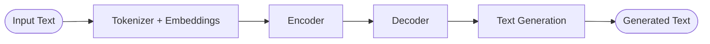

# Architecture d'un LLM : aux origines
L'utilisation des réseaux de neurones pour le NLP

<v-clicks>

- Les RNN et LSTM ont dominé le NLP pour la modélisation de séquences.  
- Problèmes majeurs des RNN/LSTM :
  - Difficulté à capturer les dépendances longues  
  - Entraînement séquentiel lent (pas de parallélisation efficace)
- **Les Transformers** (Vaswani et al., 2017) :  
  - Remplacent les mécanismes de récurrence par **l’attention**
  - Permettent un **apprentissage parallèle** et gèrent efficacement les **dépendances longues**
</v-clicks>

<!--
Historique rapide : avant 2017, les architectures seq2seq reposaient surtout sur des RNN type LSTM ou GRU, combinées à des mécanismes d'attention, mais limités. Les Transformers ont fait évoluer le domaine à grande vitesse.

RNN : Réseau de Neurones Récurrent
LSTM : Long Short-Term Memory
-->

---
transition: slide-left
---

# Architecture d'un LLM : le mécanisme d'attention

Self-Attention

<v-clicks>

- **Idée-clé** : pour chaque token d’une séquence, calculer combien il doit “s’intéresser” aux autres tokens.  
- Chaque token est projeté en trois vecteurs :
  - **Query** (Q)  
  - **Key** (K)  
  - **Value** (V)  
- L’attention se calcule comme :

$$
\text{Attention}(Q, K, V) = \text{Softmax}\left(\frac{QK^\top}{\sqrt{d_k}}\right)V
$$

- **Avantages** :  
  - Capture les relations dépendant du contexte global  
  - Facile à paralléliser (multiplications de matrices)

</v-clicks>

<!--
Chaque token de la séquence est multiplié par trois matrices d'apprentissage pour obtenir Q, K et V. Le mécanisme d'attention compare Q de chaque token à K de tous les tokens pour générer des poids.
-->

---
transition: slide-left
---

# Architecture d'un LLM : le mécanisme d'attention

Comparaison avec RNN et LSTM

<v-clicks>

- **RNN/LSTM** : traite la séquence **token après token**
  - Propagation de l’information limitée par l’historique
  - Difficile de capturer les dépendances éloignées
- **Self-Attention** : utilise des **opérations de type matriciel**
  - Accès direct à tous les tokens de la séquence
  - Mieux adapté au calcul parallèle
  - Gère facilement les longues dépendances

</v-clicks>

<!--
Le gain principal : la parallélisation. Les Transformers permettent de traiter tous les tokens simultanément, tandis que les RNN traitent la séquence de façon récursive.
-->

---
transition: slide-left
---

# Architecture d'un LLM : Les transformers
Une vue d'ensemble

Les composants principaux :

<v-clicks>

- Encodeur : extraire des représentations contextuelles de la séquence d'entrée
- Décodeur : génère la sortie pas à pas en tenant compte des tokens déjà générés
- Embeddings : Représentation vectorielle des tokens

</v-clicks>

<!--
Le Transformer original se présente comme un empilement de N blocs encodeurs et N blocs décodeurs. Dans certains modèles, on n’utilise que l’encodeur ou que le décodeur
-->

---
transition: slide-left
---

# Architecture d'un LLM : Les transformers

Exemples de modèles

<v-clicks>

- **BERT** : (Bidirectional Encoder Representations from Transformers)
  - Utilise uniquement la partie encodeur
  - Conçu pour des tâches de compréhension (classification, QA, etc.)
- **GPT** : (Generative Pre-trained Transformer)
  - Utilise uniquement la partie décodeur
  - Conçu pour la génération de texte
- **T5** : (Text-to-Text Transfer Transformer)
  - Utilise les deux parties encodeur et décodeur
  - Conçu pour traiter toutes les tâches de NLP comme une transformation de texte (traduction, résumé, etc.)

</v-clicks>

<!--
Chacun de ces modèles a été pré-entraîné sur des volumes massifs de texte et peut être fine-tuné pour des tâches spécifiques
-->
