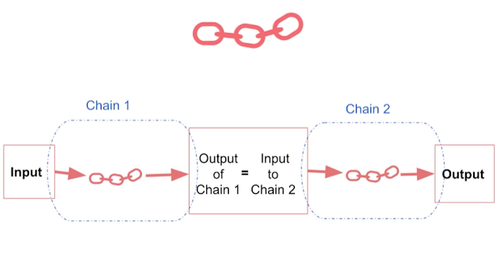
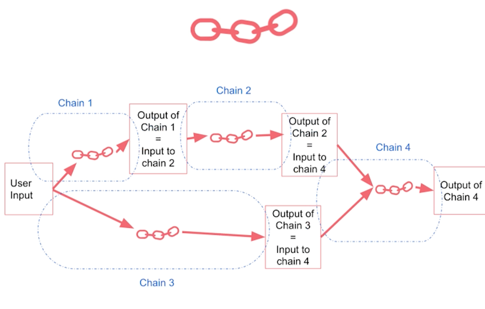
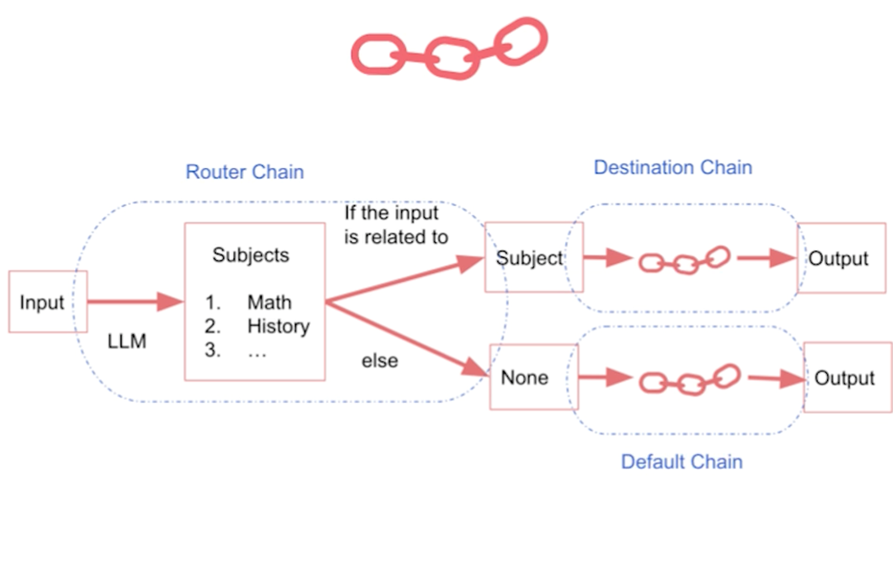
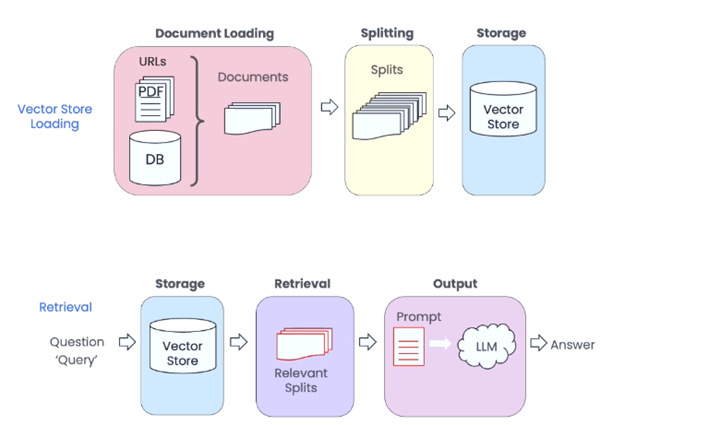

# Programme de la formation

| **Jour** | **Intitulé** |
| --------------------------------------------------- | --------------------------- |
| <span v-mark.underline.blue="1"> Lundi 20/01 </span>| Introduction aux LLM |
| Mardi 21/01 | 📝🤹Prompt Engineering pour les développeurs |
| Mercredi 22/01 | <span v-mark.circle.orange="2">AI Python for beginners</span> |
| Jeudi 23/01 | 📝🤹Construire des applications avec des API LLM |
| Vendredi 24/01 | Chat with Document (RAG) 1/2 |
| Lundi 27/01 | 📝🤹Chat with Document (RAG) 2/2 |
| Mardi 28/01 | 📝🤹Functions, Tools and Agents with LangChain |
| <span v-mark.underline.blue="1"> Mercredi 29/01 </span> | Vector Databases : Des Embeddings aux Applications |

<!--
Here is another comment.
-->

---
transition: slide-left
---

# Prompt Engineering pour les développeurs

Des bons principes pour écrire des prompts efficaces et des exemples d'utilisation des LLMs

## Principes

<v-clicks>

1. **Soyez <span v-mark.circle.red="1">clair</span> et précis**

    1. Utilisez des délimiteurs
    2. Demandez une sortie structurée
    3. Demandez au modèle de vérifier si les conditions sont satisfaites
    4. Donnez queques exemples

2. **Donnez du temps au LLM pour réfléchir**

    1. Spécifiez les étapes nécessaires pour accomplir la tâche
    2. Demandez au modèle d'élaborer sa propre solution avant de se précipiter vers une conclusion

3. **Adopter une démarche <span v-mark.underline.blue="3">itérative</span>**

</v-clicks>


---
transition: slide-left
layout: image-right
image: ../images/blades2.png
---

# Prompt Engineering pour les développeurs

Des bons principes pour écrire des prompts efficaces et des exemples d'utilisation des LLMs

## Exemples d'utilisation

<v-clicks>

- Résumer un texte
- Analyser des sentiments
- Transformer un texte
- Personnaliser une réponse client
- Créer un premier chatbot

</v-clicks>

---
transition: slide-left
---

# Construire des applications avec les API des LLMs

Quelques exemples d'utilisation des API des LLMs

<div v-click="1">
```python {all|all|1|2|3|4|11|all}
def get_completion_from_messages(messages, 
                                 model="gpt-4o-mini", 
                                 temperature=0, 
                                 max_tokens=500):
    response = client.chat.completions.create(
        model=model,
        messages=messages,
        temperature=temperature, # this is the degree of randomness of the model's output
        max_tokens=max_tokens, # the maximum number of tokens the model can ouptut 
    )
    return response.choices[0].message.content
```
</div>

<div v-click="7">
```python {all|2|2-4|5|5-6|all}
messages =  [  
{'role':'system',
 'content':"""Vous êtes un assistant qui réponds en prenant le style d'un conteur pour enfants.
Toutes vos réponses doivent être d"une seule phrase."""},    
{'role':'user',
 'content':"""Ecrivez une histoire sur une carotte heureuse."""},
] 
```
</div>

---
transition: slide-left
---

# Construire des applications avec les API des LLMs

Mise en place d'un workflow complet

<v-clicks>

## **Evaluation des entrées**

- Classification des entrées
- Utilisation des API de modération

## **Traitement des informations**

- Méthode de traitement : Chain of Thought
- Enchainement de prompts

## **Evaluation des sorties**

- Vérification des sorties
- Evaluation de la pertinence des réponses

</v-clicks>

---
transition: slide-left
layout: two-cols-header
---

# Langchain

Introduction au framework Langchain

::left::

<div v-click>
  
</div>

::right::
<div v-click>
  
</div>

---
transition: slide-left
---

# LangChain - Chat with Document (RAG)

Utilisation de Langchain pour un contexte de RAG <span v-mark.red="3">(Retrieval Advanced Generation)</span>



---
transition: slide-left
layout: default
---
# Agents
Comment décupler le pouvoir des LLMs

<div v-click class="flex items-center">
    
</div>

<div v-click>

__Workflow__ : Des systèmes où les LLMs et les outils sont orchestrés à travers des chemins de code prédéfinis.

__Agents__ : Des systèmes où les LLMs dirigent dynamiquement leurs propres actions et l'utilisation des outils, en conservant <span v-mark.circle.green="3">le contrôle </span>sur la manière dont ils accomplissent les tâches.

</div>